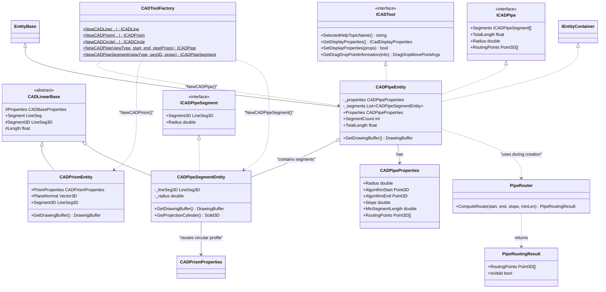
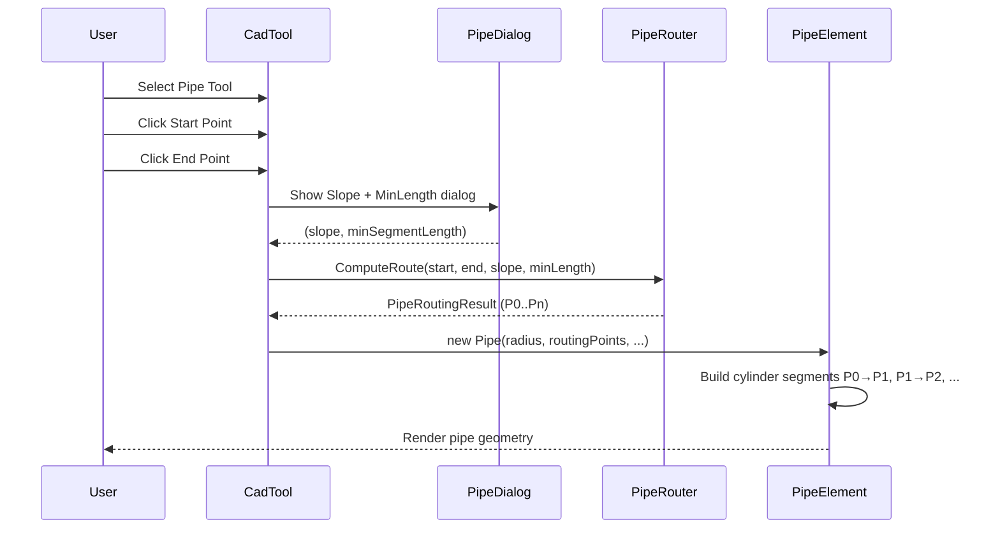

## Class Diagram

```mermaid
classDiagram
    direction TB

    CADLinearBase <|-- CADPrismEntity
    CADLinearBase <|-- CADPipeSegmentEntity
    EntityBase <|-- CADPipeEntity
    ICADTool <|.. CADPipeEntity
    ICADPipeSegment <|.. CADPipeSegmentEntity
    ICADPipe <|.. CADPipeEntity
    IEntityContainer <|.. CADPipeEntity

    CADToolFactory ..> CADPipeEntity : "NewCADPipe()"
    CADToolFactory ..> CADPrismEntity : "NewCADPrism()"
    CADToolFactory ..> CADPipeSegmentEntity : "NewCADPipeSegment()"

    CADPipeEntity o-- CADPipeSegmentEntity : "contains segments"
    CADPipeEntity --> CADPipeProperties : has
    CADPipeSegmentEntity --> CADPrismProperties : "reuses circular profile"

    PipeRouter ..> PipeRoutingResult : returns
    CADPipeEntity ..> PipeRouter : "uses during creation"

    class CADToolFactory {
        +NewCADLine(...)$ ICADLine
        +NewCADPrism(...)$ ICADPrism
        +NewCADCircle(...)$ ICADCircle
        +NewCADPipe(viewType, start, end, pipeProps)$ ICADPipe
        +NewCADPipeSegment(viewType, seg3D, props)$ ICADPipeSegment
    }

    class ICADTool {
        <<interface>>
        +SelectedHelpTopicName() string
        +GetDisplayProperties() ICadDisplayProperties
        +SetDisplayProperties(props) bool
        +GetDragDropPointInformation(info) DragDropMovePointArgs
    }

    class ICADPipe {
        <<interface>>
        +Segments ICADPipeSegment[]
        +TotalLength float
        +Radius double
        +RoutingPoints Point3D[]
    }

    class ICADPipeSegment {
        <<interface>>
        +Segment3D LineSeg3D
        +Radius double
    }

    class CADLinearBase {
        <<abstract>>
        #Properties CADBaseProperties
        +Segment LineSeg
        #Segment3D LineSeg3D
        #Length float
    }

    class CADPrismEntity {
        +PrismProperties CADPrismProperties
        +PlaneNormal Vector3D
        +Segment3D LineSeg3D
        +GetDrawingBuffer() DrawingBuffer
    }

    class CADPipeSegmentEntity {
        -_lineSeg3D LineSeg3D
        -_radius double
        +GetDrawingBuffer() DrawingBuffer
        +GetProjectionCylinder() Solid3D
    }

    class CADPipeEntity {
        -_properties CADPipeProperties
        -_segments List~CADPipeSegmentEntity~
        +Properties CADPipeProperties
        +SegmentCount int
        +TotalLength float
        +GetDrawingBuffer() DrawingBuffer
    }

    class CADPipeProperties {
        +Radius double
        +AlgorithmStart Point3D
        +AlgorithmEnd Point3D
        +Slope double
        +MinSegmentLength double
        +RoutingPoints Point3D[]
    }

    class PipeRouter {
        +ComputeRoute(start, end, slope, minLen) PipeRoutingResult
    }

    class PipeRoutingResult {
        +RoutingPoints Point3D[]
        +IsValid bool
    }
```

## Sequence Diagram

```mermaid
sequenceDiagram
    participant User
    participant CadTool
    participant PipeDialog
    participant PipeRouter
    participant PipeElement

    User->>CadTool: Select Pipe Tool
    User->>CadTool: Click Start Point
    User->>CadTool: Click End Point
    CadTool->>PipeDialog: Show Slope + MinLength dialog
    PipeDialog-->>CadTool: (slope, minSegmentLength)
    CadTool->>PipeRouter: ComputeRoute(start, end, slope, minLength)
    PipeRouter-->>CadTool: PipeRoutingResult (P0..Pn)
    CadTool->>PipeElement: new Pipe(radius, routingPoints, ...)
    PipeElement->>PipeElement: Build cylinder segments P0→P1, P1→P2, ...
    PipeElement-->>User: Render pipe geometry
```