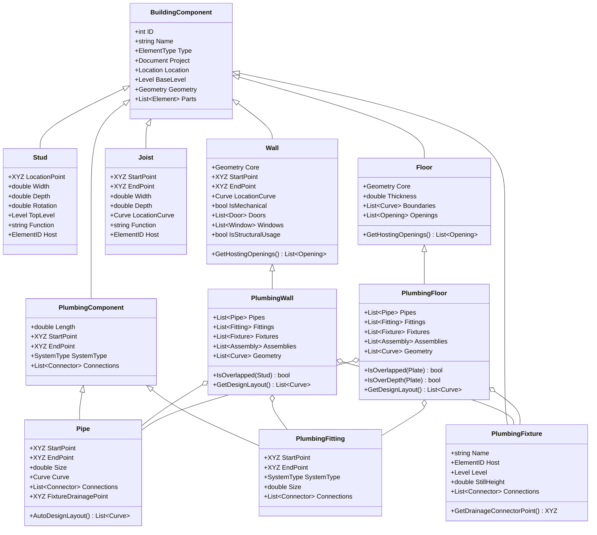

# Summary: BIM-based Automated Design of Drainage Systems for Panelized Residential Buildings

The paper proposes a method to automate the design and shop drawing generation of residential drainage systems (PRBD) in a BIM environment for panelized construction. This solution improves productivity, eliminates design errors, and minimizes material waste.

## 1. Methodology
The process is divided into 4 main phases:
*   **Scenario-based Vent Pipe Design:** Provides 3 scenarios: individual vent per fixture, a single common vent for all, or sharing the sink's vent with other nearby fixtures [8, 26, Table 1].
*   **Rule-based Drainage Pipe Design:** Uses a heuristic algorithm (combining Greedy, A-star, and Dijkstra) to automatically find the shortest path with the fewest turns from the fixture to the drainage stack, with constraint checks for joist penetration and floor openings.
*   **Panelization:** The overall pipe network is automatically segmented at intersection points with wall/floor panel boundaries, then couplings are inserted at each cut point.
*   **Cutting Optimization:** Applies an Integer Programming algorithm to cut standard-length pipes into required segments while minimizing material waste.

## 2. Implementation
*   **Platform:** The system was programmed in C# as an add-on for Autodesk Revit, using the Revit API.
*   **Inputs:** BIM model at minimum LOD 300 detail level, pipe routing priority list, pre-framed panels, plumbing fixture information, and standard pipe dimensions.
*   **Outputs:** 3D model, plan layout drawings, individual shop drawings per panel, Bill of Materials (BOM), and optimized pipe cutting configurations.
*   **Case Study:** Applied to a 2-storey townhouse model with 5 units, the add-on reduced plumbing system design time from approximately 1 week to about 20 minutes. Material waste rate with the optimization algorithm was only 13.02%, lower than the 19.43% from manual cutting methods [40, Table 4].

---

## 3. UML System Design Diagram (BIM Information for PRBD System Design)

Below is the Class Diagram modeling the database structure and BIM objects in Revit used by the system (based on Figure 7 of the paper).

